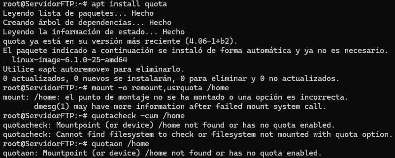

## Servidor FTP vsftpd

O obxectivo desta tarefa é instalar o servidor FTP vsftpd nun equipo Ubuntu Server/Debian

Tomaremos a máquina gandalf dos exercicios anteriores.

Instala o paquete vsftpd e configurao da seguinte maneira:   
    
- Actualizamos o sistema

    

- Instalamos o servizo FTP

    

1. A mensaxe de benvida debe ser un ASCII Art da personaxe "Gandalf o Gris"

- Creamos un ficheiro onde gardaremos o ASCII Art

    

- Modificamos o ficheiro /etc/vsftpd.conf co noso banner

    

2. Habilita o permiso de escritura aos usuarios locais. Cando suban ficheiros, deben perder o permiso de execución para o grupo e para outros.

- Modificamos o ficheiro /etc/vsftpd.conf permitindo escritura e configurando os permisos dos ficheiros

    
3. Impide o acceso de todos os usuarios locais fora do seu diectorio home permitindo que poidan escribir so no directorio public_html do seu directorio home.

- Modificamos o ficheiro /etc/vsftpd.conf

    

- Configuramos os permisos para que os usuarios locais só poidan escribir en ~/public_html

    

4. Habilita o acceso anónimo no directorio /sauron, permitindo subir ficheiros e crear directorios. O propietario de tales ficheiros debe ser o usuario saruman

- Engadimos as opcións no ficheiro de configuración /etc/vsftpd.conf

    

- Creamos o directorio /sauron e configuramos os permisos

    
    

5. Instala un certificado dixital, para poder encriptar as transferencias. Probao instalando o paquete ftp-ssl nun cliente.

- Xeramos un certificado autofirmado

    
    

- Modificamos o arquivo de configuracion para poder usar SSl

    

6. Habilita as cuotas de disco dos usuarios, limitandoas a 10 Mb por usuario.

- Activamos as cotas de disco instalando quota:

    

7. Establece como tempo de inactividade máximo 60 segundos, e de tempo de inactividade nas transferencias 90 segundos.

- Modificamos o arquivo de configuración, quedando da seguinte forma:

    

8. Non poderán conectarse máis de 4 sesións simultaneas nin máis de 2 por enderezo IP do cliente.

- Modificamos o arquivo de configuración, quedando da seguinte forma:

    

9. Establece o ficheiro de log, en /var/log/ftp.log

- Modificamos o arquivo de configuración, quedando da seguinte forma:

    